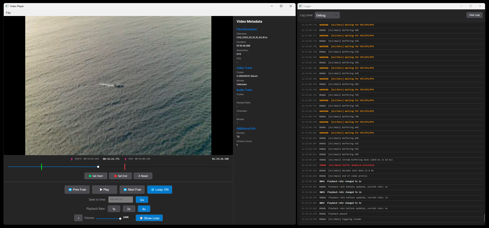

# Avalonia Video Player - Cross-Platform Build

This project is a cross-platform video player application built with Avalonia UI and LibVLCSharp. It is compiled inside a Docker container on Linux/macOS but produces a Windows executable that runs on Windows hosts.



## Features

- Modern dark-themed video player UI
- Supports multiple video formats: MP4, AVI, MKV, MOV, WMV, FLV, WebM, TS
- Advanced playback controls:
  - Play/Pause with visual feedback
  - Frame-by-frame navigation (Previous/Next Frame)
  - Timeline scrubbing with visual markers
  - Loop playback between custom start/end markers
  - Direct time seeking (HH:MM:SS format)
  - Variable playback speed (1x, 2x, 4x)
- **Audio Controls:**
  - Volume slider (0-100%)
  - Mute/Unmute toggle button
  - Visual volume percentage display
- **Comprehensive Video Metadata Display:**
  - File information (filename, duration, format, stream count)
  - Video track details (codec, resolution, frame rate, bitrate)
  - Audio track details (codec, sample rate, channels, bitrate)
  - Support for 40+ video and audio codecs (H.264, H.265, VP9, AV1, AAC, MP3, etc.)
  - Real-time metadata extraction and display
- **Developer Tools:**
  - Integrated logger window with real-time log display
  - Log level filtering (Debug, Info, Warning, Error)
  - VLC internal logging integration
  - F12 keyboard shortcut to open logger
  - Color-coded log entries
- Powered by LibVLC for robust video playback
- Built with Avalonia UI for cross-platform compatibility

## Project Structure

```
.
├── src/
│   ├── Program.cs                  # Application entry point
│   ├── App.axaml                   # Application resources
│   ├── App.axaml.cs                # Application initialization
│   ├── MainWindow.axaml            # Video player UI layout
│   ├── MainWindow.axaml.cs         # Video player logic
│   ├── LoggerWindow.axaml          # Logger window UI layout
│   ├── LoggerWindow.axaml.cs       # Logger window logic
│   ├── Logger.cs                   # Logging system implementation
│   ├── VideoMetadataExtractor.cs   # Metadata extraction helper
│   └── VideoPlayer.csproj          # Project configuration
├── Dockerfile                      # Docker build instructions
├── docker-compose.yml              # Docker Compose configuration
├── Makefile                        # Build automation
├── CLAUDE.md                       # Detailed technical documentation
├── METADATA_DECODER_IMPLEMENTATION.md  # Metadata API guide
└── bin/                            # Output directory (created after build)
```

## Prerequisites

- Docker installed and running
- Make (optional, but recommended)

## Usage

### Using Make (Recommended)

```bash
# Build the application
make build

# Deploy the binary to ./bin directory
make deploy

# Build and deploy in one step
make all

# Clean up artifacts
make clean

# View all available commands
make help
```

### Using Docker Directly

```bash
# Build the Docker image
docker build -t helloworld:latest .

# Create a temporary container and copy the binary
docker create --name temp-builder helloworld:latest
mkdir -p bin
docker cp temp-builder:/app/publish/. ./bin/
docker rm temp-builder
```

### Using Docker Compose

```bash
docker-compose build
docker-compose up
```

## Running the Application

After building and deploying, transfer the entire `./bin/` directory to your Windows machine and run `VideoPlayer.exe`.

The binary is self-contained and includes the .NET runtime and VLC libraries, so no additional dependencies are required on the Windows host.

### Using the Video Player

1. Launch `VideoPlayer.exe` on Windows
2. Click **File > Open** (or press Ctrl+O) to select a video file
3. Use the playback controls:
   - **Play/Pause**: Start, resume, or pause playback
   - **Previous/Next Frame**: Navigate frame-by-frame for precise control
   - **Timeline Slider**: Scrub through the video by dragging (with millisecond precision)
   - **Loop**: Toggle loop playback between custom markers
   - **Set Start/End Markers**: Mark loop points on the timeline
   - **Seek to Time**: Jump to specific timestamp (HH:MM:SS format)
   - **Playback Rate**: Adjust playback speed (1x, 2x, 4x)
4. Adjust audio:
   - **Volume Slider**: Control audio level (0-100%)
   - **Mute Button**: Toggle audio on/off (🔊/🔇)
5. View comprehensive metadata in the **Video Metadata** panel (right side):
   - **File Information**: Filename, duration, format, stream count
   - **Video Track**: Codec (e.g., H.264/AVC), resolution, FPS, bitrate
   - **Audio Track**: Codec (e.g., AAC), channels, sample rate, bitrate
   - **Additional Info**: Container format and track details
6. Developer tools:
   - **Show Logger Button**: Open the logger window to view application and VLC logs
   - **F12 Shortcut**: Quick access to logger window
   - **Log Filtering**: Filter by Debug, Info, Warning, or Error levels
   - **Auto-scroll**: Logger automatically scrolls to newest entries

## Configuration

The application is configured to build for Windows x64 (`win-x64`) as specified in the Dockerfile (line 20).

To target a different runtime, modify the `-r` parameter in `Dockerfile:20`. Available options include:
- `win-x64` - Windows 64-bit (default)
- `win-x86` - Windows 32-bit
- `win-arm64` - Windows ARM 64-bit
- `linux-x64` - Linux 64-bit
- `osx-x64` - macOS Intel
- `osx-arm64` - macOS Apple Silicon

## Technology Stack

- **Framework**: .NET 8.0
- **UI Framework**: Avalonia UI 11.0.10
- **Video Engine**: LibVLCSharp 3.8.5
- **Theme**: Fluent Design with dark color scheme
- **Build Environment**: Docker with .NET SDK 8.0

## Documentation

For detailed technical documentation, architecture details, and enhancement opportunities, see:
- **[CLAUDE.md](CLAUDE.md)** - Complete project documentation and architecture
- **[METADATA_DECODER_IMPLEMENTATION.md](METADATA_DECODER_IMPLEMENTATION.md)** - Metadata extraction API guide and examples
